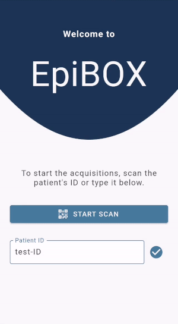
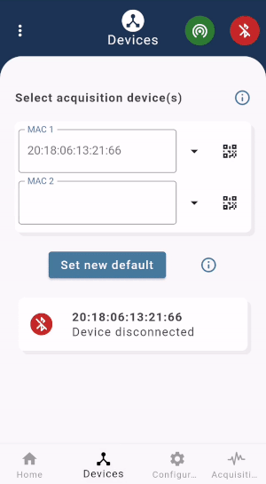
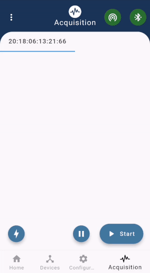

# EpiBOX, the Mobile App
## A Research Tool to Stimulate Collaboration Within Biosignal Collection

EpiBOX was developed as a way to enable researchers to escalate their data collection process by leveraging the human resources available. By providing a versatile, discreet, user-friendly and open-source system, operated through a mobile application, we hope to enable researchers to delegate the task of data collection to less proficient individuals.

EpiBOX app is a user-friendly interface to configure, start, visualize, pause and stop acquisitions with wearable devices. Currently, EpiBOX supports BITalino-based equipments allowing for the recording, storage and visualization of up to 12 channels simmultaneously. 

[currently available for Android OS only]

## Requirements
- This mobile app is complementary to the Python package epibox (available @ [epibox (GitHub)](https://github.com/anascacais/epibox) and [epibox (PyPI)](https://pypi.org/project/epibox/))
- It also requires a Raspberry Pi set up as a wireless access point and MQTT broker in order to ensure communication between the mobile app and the recording unit (RPi itself or another Linux device).

## Features

- Step-by-step interactions to start the acquisition
- History of acquisition devices
- Default configurations for optimized interaction
- Real-time visualization of up-to 12 channels
- In-acquisition annotations

  

## Additional Resources

Why BITalino: 
 - Versatility of sensors & flexibility of wearable form-factors
 - Rapid & cheap prototyping
 - Peer-validated against gold-standards

Why Raspberry Pi:
 - Discreteness
 - Affordability 
 - Ease of system replication - through shell script or RPi imager
 - Computational and storage power

Get to know our project @ [LinkedIn - PreEpiSeizures](https://www.linkedin.com/feed/update/urn:li:activity:6787017108631941120/)

## License

MIT

## Contact

For any additional information about the mobile app or our project please contact me: anascacais@gmail.com
